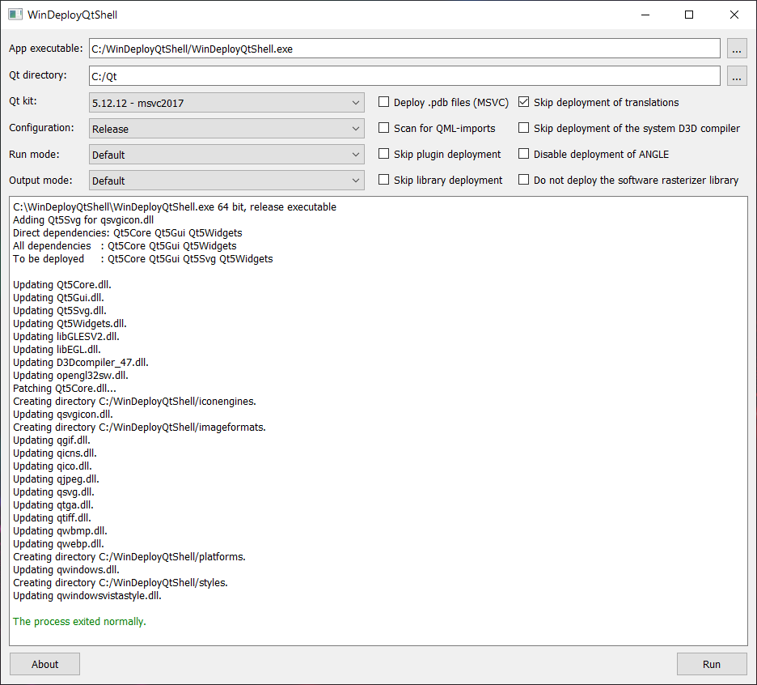

# WinDeployQtShell
WinDeployQtShell is a shell for Qt deploy tool (windeployqt.exe).
### How to use
- select the application executable file
- set the folder where Qt is installed
- select a Qt kit (they are automatically detected from the Qt folder)
- configure the options
- push on the "Run" button
### Screenshot
